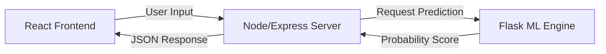

# 🏏 MERN IPL Predictor


> A powerful hybrid application that combines the MERN stack with a Python Flask Machine Learning service to predict the outcome of IPL matches with high accuracy.

---

## 🔗 Live Demo

| Application | URL |
| :--- | :--- |
| **IPL Predictor App** | [Launch App 🚀](https://mern-ipl-predictor-frontend.onrender.com) |

---

## 🏗️ Architecture

This project uses a microservices-like architecture where the **Node.js** backend handles user data and application logic, while a dedicated **Flask** service runs the Machine Learning model for predictions.



---

## 🚀 Key Features

- **Match Prediction**: Predict the win probability of a chasing team based on current match stats.
- **Hybrid Backend**: Seamless integration between Node.js (Application logic) and Python (Data Science).
- **Real-time Stats**: Input runs, wickets, and overs to get dynamic winning chances.
- **Team & Venue Analysis**: Support for all major IPL teams and stadiums.
- **Interactive UI**: Clean, responsive React interface for easy interaction.

---

## 🛠️ Tech Stack

**Frontend:**
-  **React.js**
-  **Tailwind CSS**

**Backend (App Logic):**
-  **Node.js**
-  **Express.js**
-  **MongoDB**

**Machine Learning Engine:**
-  **Python**
-  **Flask**
-  **Scikit-Learn**

---

## 💻 Installation & Setup

Clone the repository:

```bash
git clone [https://github.com/aryan-chaudhary23/MERN_IPL_Predictor.git](https://github.com/aryan-chaudhary23/MERN_IPL_Predictor.git)
cd MERN_IPL_Predictor
```

### 1. Setup Client (Frontend)
```bash
cd client
npm install
npm start
# Runs on localhost:3000
```

### 2. Setup Server (Node Backend)
Open a new terminal:
```bash
cd server
npm install
node index.js
# Runs on localhost:5000 (approx)
```

### 3. Setup Flask (ML Engine)
Open a new terminal:
```bash
cd flask
pip install -r requirements.txt
python app.py
# Runs on localhost:5001 (approx)
```

---

## 🤝 Contributing

1. Fork the project
2. Create your feature branch (`git checkout -b feature/NewAlgorithm`)
3. Commit your changes (`git commit -m 'Improved prediction accuracy'`)
4. Push to the branch (`git push origin feature/NewAlgorithm`)
5. Open a Pull Request

---

## 📬 Contact

Aryan Chaudhary - [GitHub Profile](https://github.com/aryan-chaudhary23)

Project Link: [https://github.com/aryan-chaudhary23/MERN_IPL_Predictor](https://github.com/aryan-chaudhary23/MERN_IPL_Predictor)
